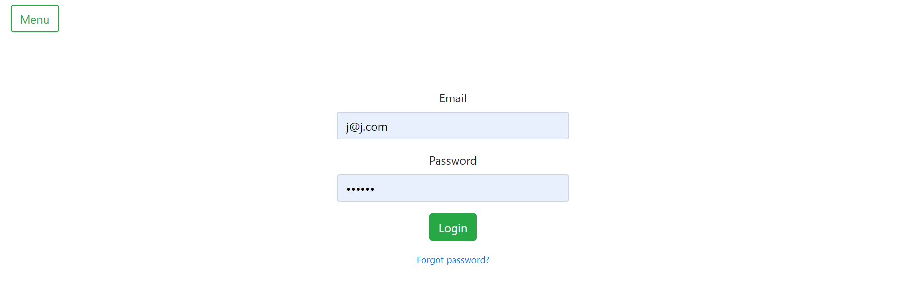
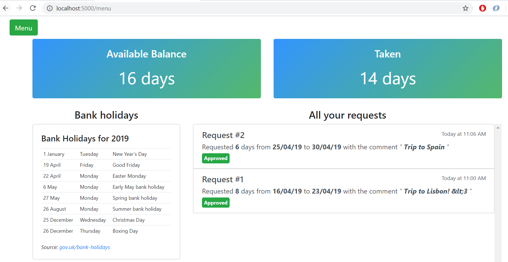
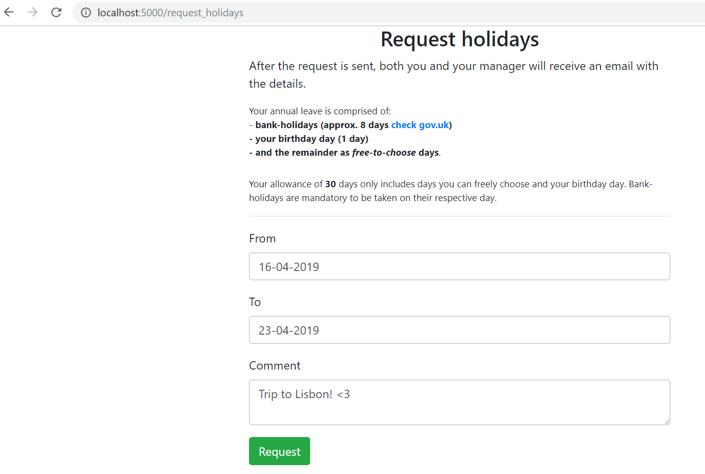
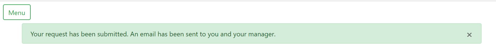
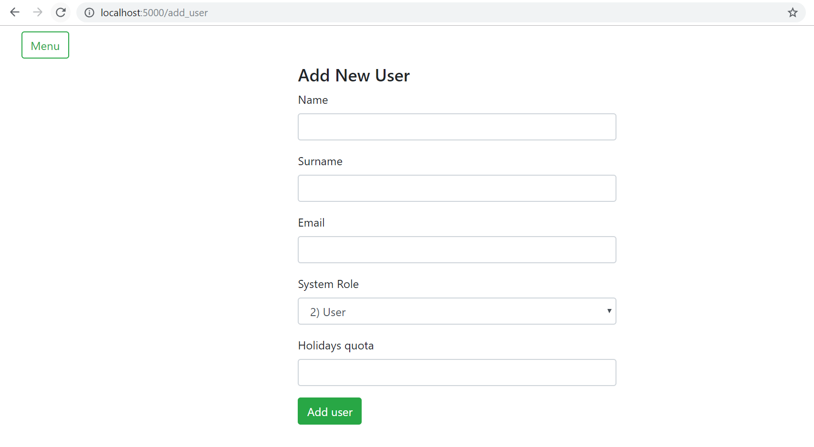
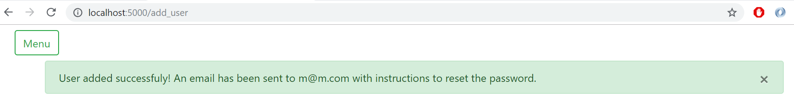
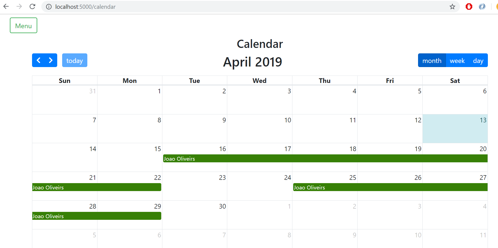

## holidayTracker - a Flask application

#### Coming soon! [Download the video]() of this application in action. 


Main features:
+ RBAC - Role Based Access Control (Admin/User)
+ Email integration 
+ Confirm account through email - uses jwt tokens
+ Admin area to manage Users and Requests
+ Calendar view

Stack:
+ Python Flask (handles requests, authentication, routing and db queries)
+ SQLAlchemy (this example uses an sqlite db but could integrate mysql)
+ Bootstrap layout
+ FullCalendar.js plugin
+ Emails are sent via SMTP through Flask-Mail


More details of modules used in the [requirements.txt file](https://github.com/j-000/holidayTracker/blob/master/requirements.txt). 

***

Login page uses [Bootstrap](https://getbootstrap.com/) for the layout and styling. Authentication and session is done thanks to Flask.




Bootstrap layout for responsive web pages both in a desktop and mobile environments.



The server side email sending is done via an asynchromnous thread using Google's smtp and [Flask-Mail](https://pythonhosted.org/Flask-Mail/).







In this route I wanted to use a calendar view and decided to use [FullCalendar.js](https://fullcalendar.io/) plugin to accomplish that. 



## Getting started (Windows 10)

##### 1) Clone the repo and install the requirements
Do this in a virtualenv folder, preferably. See [virtualenv for python](https://docs.python-guide.org/dev/virtualenvs/) for details.
```
(venv) clone https://github.com/j-000/holidayTracker
(venv) pip install -r requirements
```

##### 2) Create your config file with the following python dicts
**'mail_settings'** - works on gmail accounts only. You will need to [allow less secure apps](https://myaccount.google.com/lesssecureapps?pli=1) to be able to send email through the application.

**admin_user** - The email described in this dict will be the one used to send emails and alerts via the application.
```
mail_settings = {
  'MAIL_USERNAME' : 'your email',
  'MAIL_PASSWORD' : 'your password',
  'MAIL_DEFAULT_SENDER' : 'your email again'
}

app_settings = {
'SQLALCHEMY_DATABASE_URI' : 'sqlite:///data.db',
'SECRET_KEY' : 'some very secret string',
'SECURITY_PASSWORD_SALT' : 'some secret hash as well'
}

admin_user = {
    'NAME' : 'your name',
    'SURNAME' : 'your surname',
    'EMAIL' : 'your email',
    'APP_PASSWORD':'some password',
    'HOLIDAYS_QUOTA' : 30
}

random_string = {
    '_' : 'aiodjaiosdjaiodjaiodjaiosdjioasdjaiodj'
}
```

save the file as **config_file.py** in the same directory as **app.py**.

##### 3) Start the Python shell in the terminal and initialize the database
This will populate the database with your User account.
```
(venv) python helperFunctions.py
```

##### 4) Run it and log in
```
(venv) python app.py
```
To login use the '**EMAIL**' and '**APP_PASSWORD**' details from the config file.

